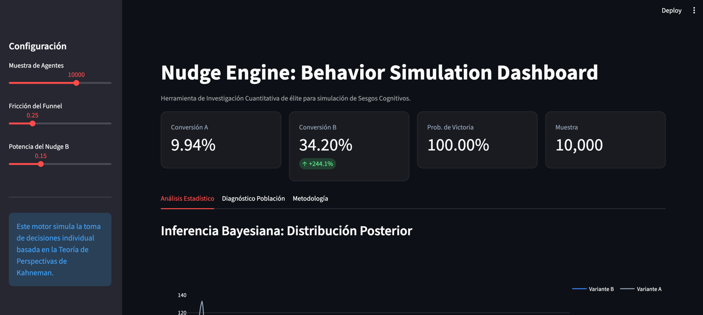
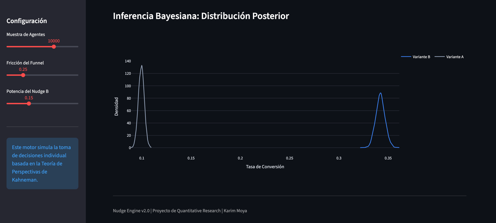

    
# Nudge Engine: Stochastic Behavioral Simulation & Bayesian Analysis

### Predicting User Decision-Making through Prospect Theory and Monte Carlo Simulations

This project is a Quantitative UX Research tool designed to simulate how cognitive biases—specifically Loss Aversion—impact conversion rates in digital funnels. Instead of relying solely on reactive A/B testing, the Nudge Engine models synthetic populations to predict outcomes using advanced statistical inference.

  

---

## The Problem: The Cost of Uncertainty in UX
Traditional A/B testing is the gold standard, but it is expensive and slow. It requires weeks of live traffic to reach statistical significance and involves the risk of exposing real users to sub-optimal experiences.

The Nudge Engine acts as a pre-validation layer, allowing researchers to:
1.  Prioritize Hypotheses: Filter low-impact ideas before committing engineering resources.
2.  Quantify Risk: Simulate high-friction scenarios to predict conversion drops.
3.  Apply Bayesian Rigor: Obtain actionable probabilities of success, overcoming the limitations of binary p-values.

---

## Scientific Foundations

### 1. Agent Modeling (Prospect Theory)
Each of the 10,000 generated agents possesses individual traits based on Daniel Kahneman’s behavioral economics:
*   **Loss Aversion Coefficient (Lambda):** Modeled with a Log-Normal distribution (mu=0.7, sigma=0.2) to reflect that the pain of losing is, on average, twice as powerful as the pleasure of gaining (Lambda approx 2.0), while maintaining population variance.
*   **Cognitive Budget:** Modeled with a Beta Distribution, representing the user's finite resistance to friction and decision fatigue.

### 2. Monte Carlo Simulation
Instead of using deterministic formulas, the engine employs stochastic brute force. For every agent, a "coin flip" (Binomial distribution) is performed based on their individual conversion probability. Aggregating these thousands of micro-experiments generates a realistic macroscopic conversion rate.

### 3. Bayesian Inference
We replace classical frequentist statistics with a Beta-Bernoulli model.
*   We compare the "Posterior" distributions of variants A and B.
*   We calculate the Probability of Superiority: the percentage of times Variant B beats Variant A across 4,000 simulated universes, providing a direct business decision metric.

---

## Technical Architecture (OOP)
The system follows high-level software engineering principles, decoupling logic from presentation (Separation of Concerns):

*   **engine.py (Domain Layer)**: Contains the `NudgeEngine` class. It encapsulates mathematical logic, distribution generation, and statistical sampling. It is UI-agnostic.
*   **app.py (Presentation Layer)**: Reactive interface built with Streamlit. It handles input capture, data visualization with Plotly, and user experience.

---

## Installation & Usage

1. Clone the repository:
   ```bash
   git clone https://github.com/your-username/nudge-engine.git
   cd nudge-engine

  

   Install dependencies: 
   
   pip install -r requirements.txt

  

2. Launch the Dashboard:


        
    streamlit run app.py

      

## Results Visualization

The interactive dashboard allows for real-time adjustment of Funnel Friction and Nudge Power.
Dashboard Overview



Detail: Bayesian Uncertainty Analysis



## Model Limitations & External Validity

While the Nudge Engine is a powerful estimation tool, it should be used as a complement to, not a substitute for, real-user testing.

    Variable Reductionism: The model assumes the purchase decision depends primarily on loss aversion and cognitive load. In a real environment, exogenous factors (brand trust, price, social proof, aesthetics) play crucial roles not modeled here.

    Parameter Calibration ("Garbage In, Garbage Out"): Base parameters (Lambda approx 2.0) are derived from general academic literature. For maximum accuracy, the model should be calibrated with historical data from the specific product.

    Agent Independence: The simulation assumes users do not interact with each other. It does not capture network effects, virality, or social influence that could alter value perception.

**Conclusion**: This tool serves to discard weak hypotheses and optimize experimentation strategy, saving time and budget by testing only variants with higher theoretical probability of success.

**Developed by Karim Moya**

Quantitative UX Researcher | Software Developer